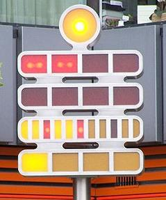

# Berlin Clock
Berlin Clock Java Implementation

## What is it?



Berlin Clock description: The time is calculated by adding the lit
rectangular lamps. The top lamp is a pump which is blinking on/off every
two seconds. In the topmost line of red lamps every lamp represents 5
hours. In the second line of red lamps every lamp represents 1 hour. So
if in the first line 2 lamps are lit and in the second line 3 lamps its
5+5+3=13h or 1 p.m. In the third line with tall lamps every lamp
represents 5 minutes. There are 11 lamps, the 3rd, 6th, and 9th are red
indicating the first quarter, half, and the last quarter of the hour. In
the last line with yellow lamps every lamp represents 1 minute.​

## Design decisions

This implementation of Berlin Clock accepts 3 parameters as below;

* hour (0-23)
* minute (0-59)
* second (0-59)

And it will return a multi-line String as below;

```
Y             <== topmost lamp (row 0);
RRRR          <== top line of red lamps;
RXXX          <== second line of red lamps;
YYRYYRYYRXX   <== third row of red/yellow lamps;
YXXX          <== fourth row of yellow lamps;
```

Each character in the response is represented as below;

* Y => Lamp is ON and YELLOW
* R => Lamp is ON and RED
* X => Lamp is OFF

## How to Run

Please use java7 or java8 and run maven.

```
mvn clean install
```
